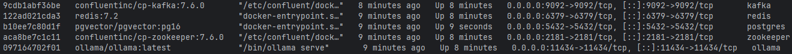

## 1. 개요

이 디렉토리는 로컬 개발 및 학습 목적의 인프라 환경을 구성하기 위한 Docker Compose 설정을 포함한다.

## 2. 구성 요소 요약

| 서비스 | 용도 |
|------|------|
| Redis | 캐시, 세션, 간단한 상태 저장 |
| Kafka | 이벤트 스트리밍 및 비동기 처리 |
| PostgreSQL | 영속 데이터 저장 |
| pgvector | 벡터 임베딩 저장 및 검색 |
| Ollama | 로컬 LLM 추론 서버 |


## 3. 디렉토리 구조

```text
infra/
 ├─ docker-compose.yml
 ├─ README.md
 └─ postgres/
     └─ init.sql
```

## 4. 실행 방법

```bash
cd infra
docker compose up -d
```

- 실행 상태 확인
> docker ps



## 5. 서비스별 상세 설명 (핵심)

### Redis
- 포트: 6379
- AOF(Append Only File) 기반 영속화 설정
- 로컬 캐시 및 임시 데이터 저장 용도

### PostgreSQL + pgvector
- PostgreSQL 16 기반
- pgvector 확장 자동 활성화
- 벡터 임베딩 저장 및 유사도 검색용

### Kafka
- 단일 브로커 구성 (로컬 개발용)
- Zookeeper 기반
- Windows 환경을 고려하여 advertised.listeners를 localhost로 설정

### Ollama
- 로컬 LLM 추론 서버
- 모델은 컨테이너 볼륨에 저장됨
- REST API를 통해 외부 애플리케이션과 연동

## 6. 포트 및 접속 정보

| 서비스 | 주소 |
|------|------|
| Redis | localhost:6379 |
| PostgreSQL | localhost:5432 |
| Kafka | localhost:9092 |
| Ollama | http://localhost:11434 |